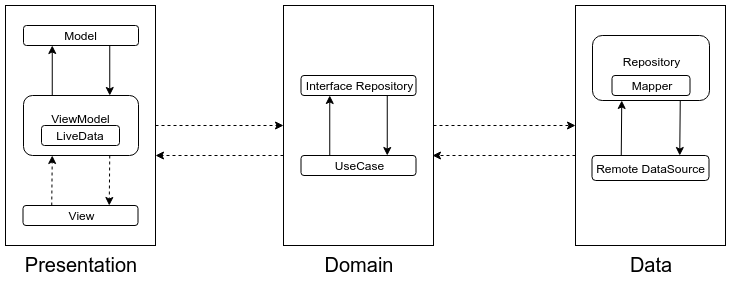

# meet-rick-and-morty
An Android app to get to know the legendary Rick and Morty characters

# Tech Stack
* Kotlin
* MVVM + Clean architecture along with Android Architecture Components (e.g. ViewModel and LiveData)
* Koin - For dependency injection
* Coroutines - To handle async operations
* Retrofit - For API consumption
* Glide - Image loading library
* Mockito 2 - Unit testing

# Architecture

# Why Clean Architecture?
* Separation of code in different layers with assigned responsibilities making it easier for further modification.
* High level of abstraction
* Loose coupling between the code
* Testing of code is painless

# What are the layers?
* Data -
  * Provides the data using the repository and data source
* Domain -
  * Contains the core business logic and interacts between data and presentation through interfaces
  * This is a purely kotlin module without any Android Dependency
* Presentation -
  * Take care of the UI logic.
  * In our case we are using MVVM in this layer but clean architecture provides us the flexibility
  * to swap it with e.g. MVP in the future without changing anything in the Domain or Data layer.

# How it looks

# TODO
* Room integration for offline support